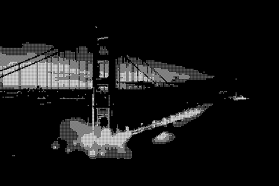
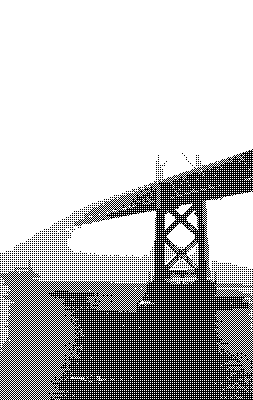
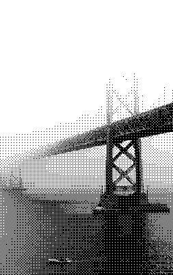
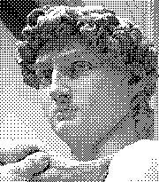
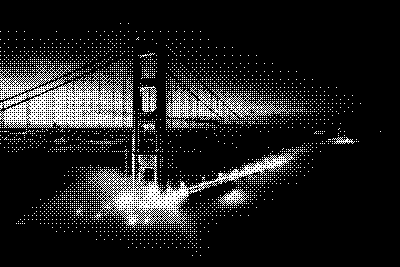
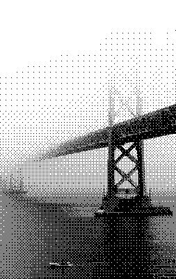
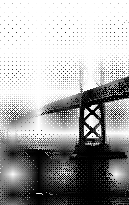
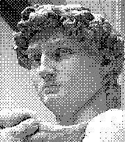
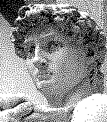

# 2D dithering shaders for Godot 4
## Introduction
This is a small collection of ordered dithering 2D shaders for Godot 4, based on [Surma's article on Ditherpunk](https://surma.dev/things/ditherpunk/). Two-colored palettes are supported.

## Demos
Bayer Level 0 (Inverted)             |  Bayer Level 0 (Normal)             |  Bayer Level 0 (No sRGB to RGB conversion)
:-----------------------------------:|:-----------------------------------:|:------------------------------------------:
    |    |

Bayer Level 1 (Inverted)             |  Bayer Level 1 (Normal)             |  Bayer Level 1 (No sRGB to RGB conversion)
:-----------------------------------:|:-----------------------------------:|:------------------------------------------:
    |    |

Bayer Level 2 (Inverted)             |  Bayer Level 2 (Normal)             |  Bayer Level 2 (No sRGB to RGB conversion)
:-----------------------------------:|:-----------------------------------:|:------------------------------------------:
    |    |

Bayer Level 3 (Inverted)             |  Bayer Level 3 (Normal)             |  Bayer Level 3 (No sRGB to RGB conversion)
:-----------------------------------:|:-----------------------------------:|:------------------------------------------:
    |    |

Blue Noise                           |Blue Noise                           |  Blue Noise (No sRGB to RGB conversion)
:-----------------------------------:|:-----------------------------------:|:------------------------------------------:
    |    |

## Usage
### For 2D:
1. Add the "materials" folder to your Godot project.
2. Drag and drop the desired material into a Sprite node.

### For 3D:
1. Add the "materials" folder to your Godot project.
2. Add a SubViewport node to the scene.
3. Add a Camera3D node as a child of the SubViewport node.
4. Add a SubViewportContainer node to the scene.
5. Add another SubViewport node as a child of the SubViewportContainer node.
6. Add a TextureRect node as a child of the second SubViewport node.
7. In the Texture property of the TextureRect node, select "New ViewportTexture" and choose the SubViewport node that contains the Camera3D.
8. Drag and drop the desired material onto the CanvasItem section of the TextureRect node.
9. The scene tree should have the following structure:

```
Node3D
[...]
  SubViewport
    Camera3D
  SubViewportContainer
    SubViewport2
      TextureRect
[...]
```

## Sources and credits

The test images come from [Surma's article on Ditherpunk](https://surma.dev/things/ditherpunk/) and [Wikimedia](https://commons.wikimedia.org/wiki/File:Michelangelo%27s_David_-_63_grijswaarden.png). The blue noise textures are from [Christoph Peter's article](https://momentsingraphics.de/BlueNoise.html) on the topic.
